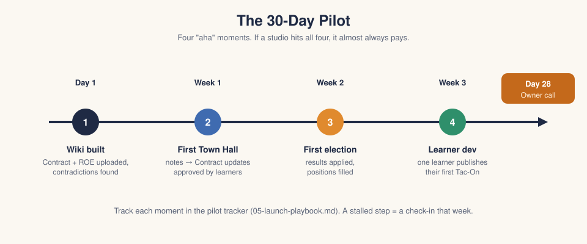
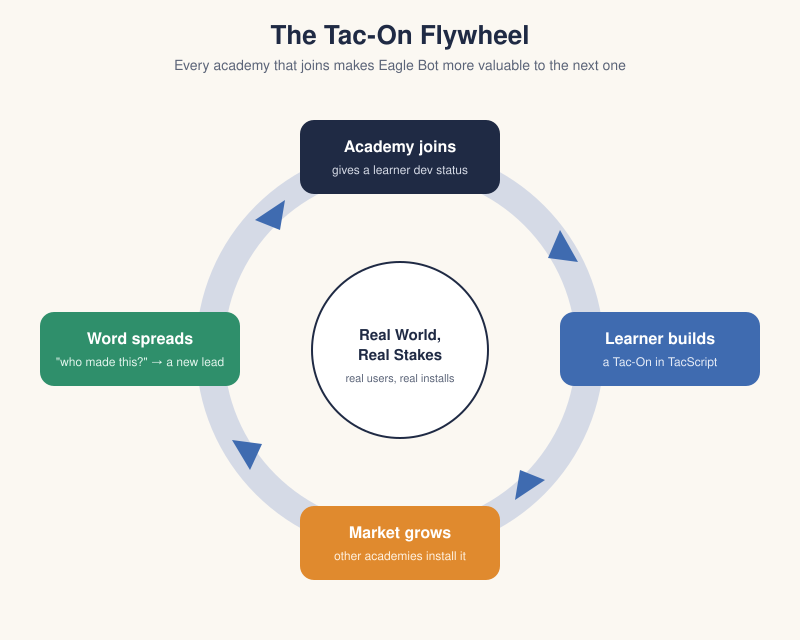

# 02 · The Funnel

Six stages. Each has one job, one thing we hand the owner, and one number we
watch. The conversion targets are guesses for the first year; replace them
with real numbers once we have ten pilots behind us.

---

## 1 · Aware — "There's a thing other academies use for their Contract"

**Goal:** an owner hears about Eagle Bot from someone they trust.

**What we do**

- Post real stories on LinkedIn and other social media: *"Our Launchpad
  Contract had two rules about phones that contradicted each other for a whole
  session. Nobody noticed until we put it into Eagle Bot."* Offer the free scan
  at the end.
- Message owners and Guides directly on LinkedIn, starting with people we
  already know and academies in zones we have a connection to.
- Link the 3-minute walkthrough video (see stage 3) from every post and
  message.
- Make Tac-Ons from Eagle learners visible in the market with author and
  academy name.
- Ask every paying owner for one introduction (with the referral credit), and
  to mention Eagle Bot in their zone and in the owner forums we can't reach.

**What we hand them:** a link to the scan sign-up page.

**Measure:** scan requests per month. **Target:** 25% of owners we reach
directly ask for a scan.

---

## 2 · Curious — the free Contract → Wiki scan

**Goal:** show value using *their* documents before asking for anything.

This is the most important stage. Eagle Bot's wiki builder already reads a
studio's documents, turns them into sections, and reports contradictions and
gaps instead of silently resolving them. We run it on the owner's Contract and
send back:

1. The wiki, as a read-only link (a demo academy on our instance).
2. A short findings report: *"3 contradictions, 5 gaps, 2 rules that may be
   outdated."*
3. One line: *"Want to see how your learners would keep this up to date after
   every Town Hall?"* → demo booking link.

**Rules for the scan**

- One studio's documents, max. It's a taste, not the product.
- Delete their documents after 14 days unless they start a pilot. Say so up
  front.
- Turnaround within one school day. Speed is part of the pitch.
- Cost to us: roughly $2–3 of Claude API per scan (see
  [03](03-pricing-and-costs.md#what-each-ai-job-costs)). Cap at 10 scans a month:
  the limit is time, not API cost (see
  [05](05-launch-playbook.md#running-it-solo)).

**Measure:** % of scans that book a demo. **Target:** 50%.

---

## 3 · Convinced — the live demo

**Goal:** the owner (and ideally a Guide) sees the whole loop that their
learners would run.

**Format: a live video call** (Zoom or Google Meet), 30 minutes, run by me. It's
live so the demo can use *their* scanned Contract and I can answer questions as
they come up. There is also a **3-minute recorded walkthrough video**. That
isn't the demo. It's what gets an owner curious enough to book the call, and it
goes in posts, LinkedIn messages and the first scan email. Record it once, on
the demo academy, and reuse it.

**Demo script**

1. *(5 min)* Their own scanned wiki. Walk through one contradiction and how
   the studio would resolve it.
2. *(10 min)* A Town Hall: paste meeting notes → Eagle Bot proposes Contract
   changes → learners approve them → wiki updates.
3. *(5 min)* Elections and Positions: running an election, results applied,
   positions filled.
4. *(5 min)* The Tac-On market: install a Tac-On in a studio, then show one an
   Eagle learner wrote, and its source code.
5. *(5 min)* Questions, then the pilot offer.

**What we hand them:** a pilot agreement (one page, no card).

**Measure:** % of demos that start a pilot. **Target:** 60%.

---

## 4 · Pilot — 30 days, one studio

**Goal:** hit four "aha" moments in one studio in 30 days.

| When | Moment | Done when |
| --- | --- | --- |
| Day 1 | Wiki built | Their Contract + ROE are uploaded and the findings are reviewed by learners |
| Week 1 | First Town Hall processed | At least one Contract change goes from meeting notes to the wiki |
| Week 2 | First election | One election run through Eagle Bot, results applied and positions filled |
| Week 3 | Learner dev | One learner has dev status and has published (or drafted) a Tac-On |
| Day 28 | Owner call | We review the four moments and offer the Founding Academy plan |

**Rules for the pilot**

- One studio only. Middle Studio or Launchpad if they have one.
- No credit card. No auto-conversion. At day 30 the pilot academy goes
  read-only until they choose a plan, so nothing is lost.
- I'm their one contact for questions, by email or a call. I check in once a
  week (see [running it solo](05-launch-playbook.md#running-it-solo)).
- At most 3 pilots run at once. Others wait for a slot.
- If a moment stalls for a week, I call the Guide.

**Measure:** moments hit per pilot, and % of pilots that pay. **Target:** 50%
convert. Pilots that hit all four moments should convert at 80%+.

---

## 5 · Paying — the Founding Academy plan

**Goal:** a signed plan, ideally annual.

- Offer the **Founding Academy** price (see [03](03-pricing-and-costs.md)) to
  the first 10 academies. It's locked for as long as they stay.
- Annual prepay gets two months free. Annual is better for us (cash up front
  to cover the subscriptions) and matches how academies budget by year.
- Move their pilot data over as-is. Nothing restarts.

**Measure:** monthly recurring revenue, and % on annual.

---

## 6 · Advocate — every studio, and learners publishing

**Goal:** the academy uses Eagle Bot in every studio and its learners publish
Tac-Ons other academies install.

- At the end of each session, offer to add the next studio (each studio is
  another wiki, another Town Hall, another set of positions).
- Run a **Tac-On Jam** each session: an online week where learners from every
  customer academy build Tac-Ons, share what they're working on, and help each
  other. It's a community event, not a competition. Nobody is judged or
  ranked, and there's no prize. Whatever a learner publishes goes into the
  market the same way it would any other week.
- Ask for the referral. Owners who have seen their learners' Tac-On installed
  at another academy are our best advocates.

**Measure:** studios per academy, Tac-Ons published per academy, referrals per
academy. **Target:** 40% of academies expand to a second studio within a year.

---

## The funnel as numbers

Working backwards from a goal of **10 paying academies in the first year**:

| Stage | Rate | Academies needed |
| --- | --- | --- |
| Paying | — | 10 |
| Pilots | 50% convert | 20 |
| Demos | 60% start a pilot | 34 |
| Scans | 50% book a demo | 67 |
| Owners reached directly | 25% ask for a scan | ~270 |

~270 owners is a real share of the Acton network, and more than one person can
message one by one. That's why the referral loop, zone introductions and
learner-built Tac-Ons matter: they reach owners we'll never meet.
