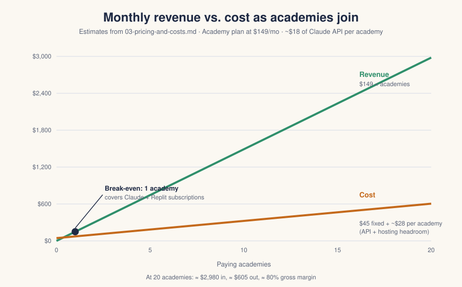

# 03 · Pricing and Costs

> **Check these numbers before you quote them.** Subscription prices change.
> Everything marked *(assumed)* should be checked on the vendor's pricing page
> before any number goes on a website. Claude API prices below are Anthropic's
> list prices as of September 2026.

## What it costs to run Eagle Bot

We have three expenses.

### 1. Fixed: subscriptions (the same whether we have 1 academy or 50)

| Expense | What it's for | Monthly |
| --- | --- | --- |
| Claude subscription (Pro) | Building Eagle Bot: Claude Code, writing, planning | ~$20 *(assumed)* |
| Replit Core | Hosting the app, the Postgres database, deployments | ~$25 *(assumed)* |
| **Total fixed** | | **~$45 / month** |

Two things to watch here:

- **Replit Core includes a monthly usage credit, not unlimited hosting.** As
  more academies use the app, the deployment and database may use more than
  the credit covers, and Replit bills the rest. The cost model below budgets
  **~$10 per academy per month** of hosting overage to stay safe. Check the
  Replit usage page monthly and replace that guess with the real number.
- If building speeds up and a larger Claude plan (Max) is needed, fixed costs
  go up by $80–180. That's still covered by 1–2 academies.

### 2. Variable: Claude API (grows with each academy)

Eagle Bot calls the Claude API for three jobs. It uses **Claude Opus 5**
by default (`ANTHROPIC_MODEL` in `.env`).

| Model | Input, per million tokens | Output, per million tokens |
| --- | --- | --- |
| Claude Opus 5 (current default) | $5.00 | $25.00 |
| Claude Sonnet 5 | $2.00 | $10.00 |
| Claude Haiku 4.5 | $1.00 | $5.00 |

Cached input (the same big documents read again) costs about a tenth of the
normal input price, and the app already caches the wiki and uploaded documents
between calls.

#### What each AI job costs

Estimates on Opus 5 at `high` effort, including thinking tokens. "Tokens" here
means roughly ¾ of a word.

| Job | When it runs | Reads | Writes | Cost per run |
| --- | --- | --- | --- | --- |
| **Build wiki** | Setup, and when new documents are uploaded | ~150K tokens (every document) | ~60K | ~$2.25 |
| **Process Town Hall** | After each meeting | ~20K (notes + current wiki, mostly cached) | ~10K | ~$0.35 |
| **Apply election** | After each election | ~15K | ~6K | ~$0.25 |
| **Free scan** (stage 2 of the funnel) | Once per lead | ~100K | ~40K | ~$1.50–3.00 |

#### A typical academy's month

A typical customer: **3 studios**, each with 4 Town Halls, 1 election and 1
wiki rebuild a month.

| | Per studio | × 3 studios |
| --- | --- | --- |
| Wiki rebuild | $2.25 | $6.75 |
| 4 Town Halls | $1.40 | $4.20 |
| 1 election | $0.25 | $0.75 |
| **Subtotal** | **~$3.90** | **~$11.70** |
| +50% buffer (re-runs, big uploads, Tac-Ons) | | **~$18** |

**Measure the real number.** Every AI job already records its input and output
tokens in the `ai_jobs` table, per academy. Once a month, add them up per
academy and multiply by the prices above. After three months, replace the
estimate on this page with the real average.

#### Ways to cut API cost if we need to

In order, cheapest to most noticeable:

1. **Keep caching working.** Already on. Don't put anything that changes
   every call (dates, IDs) at the start of prompts.
2. **Lower effort for Town Halls and elections.** The academy's AI settings
   already let us set effort; `medium` is likely fine for these smaller jobs.
   Test it on a few real meetings first.
3. **Try Sonnet 5 for Town Halls and elections**, keeping Opus 5 for the wiki
   build. That cuts those jobs by ~60%. Only do this if the output is just as
   good on real meetings.
4. **Cap wiki rebuilds** per studio per month on the lower plan.

### 3. Total cost per academy

| | Monthly |
| --- | --- |
| Claude API (typical 3-studio academy) | ~$18 |
| Hosting overage headroom | ~$10 |
| **Variable cost per academy** | **~$28** |
| Plus fixed costs, shared by all academies | ~$45 total |

---

## What we charge

Price per **academy**, not per learner. Acton academies are small (often
15–150 learners), owners hate per-seat math, and learners should never be the
thing that makes the bill go up.

| Plan | Who it's for | Monthly | Annual (2 months free) |
| --- | --- | --- | --- |
| **Studio** | One studio, or an academy trying it out | $59 | $590 |
| **Academy** | Up to 4 studios, the whole academy | $149 | $1,490 |
| **Founding Academy** | First 10 academies, Academy plan features, price locked while they stay | $99 | $990 |

Every plan includes:

- The AI wiki, Town Hall processing, elections and positions.
- The Tac-On market, dev status for learners, publishing.
- A fair-use AI allowance: **4 wiki rebuilds per studio per month**. Nobody on
  a normal schedule gets close. Past that, we talk to them; we don't
  surprise-bill.

### Why these numbers

- **Studio at $59** covers one studio's ~$4 of API and ~$10 of hosting with a
  wide margin, and is an easy yes for a single-studio owner.
- **Academy at $149** is under $1.50 per learner per month for a 100-learner
  academy. Against ~$28 of variable cost, that's about an **80% gross margin**.
- **Founding Academy at $99** rewards the risk early customers take and still
  clears ~$70 a month each.

### Break-even

| Paying academies | Revenue / mo | Cost / mo | Profit / mo |
| --- | --- | --- | --- |
| 1 (Founding) | $99 | $73 | $26 |
| 5 (Founding) | $495 | $185 | $310 |
| 10 (Founding) | $990 | $325 | $665 |
| 20 (10 Founding + 10 Academy) | $2,480 | $605 | $1,875 |

**One Founding Academy covers both subscriptions.** Everything after that is
margin, minus ~$28 per academy.

### Referral credit

When a paying academy refers an academy that becomes a paying customer, **both
get one month free**. Cost to us: ~$99–149 once, against a customer worth
~$1,000+ a year.

---

## Before we can charge anyone

Eagle Bot has no billing yet. Needed before the first paid plan:

- [ ] A way to take payment (Stripe Checkout + a customer portal is the least
      code).
- [ ] A plan field on the academy, and the pilot's read-only state at day 30.
- [ ] A monthly per-academy API usage report from `ai_jobs` (for us, not the
      customer).
- [ ] A separate Anthropic API workspace or key for production, with a monthly
      spend limit set in the Claude Console, so a bug can't run up the bill.
- [ ] Terms of service and a privacy policy that cover learner data (see
      [04-messaging.md](04-messaging.md#objections)).
