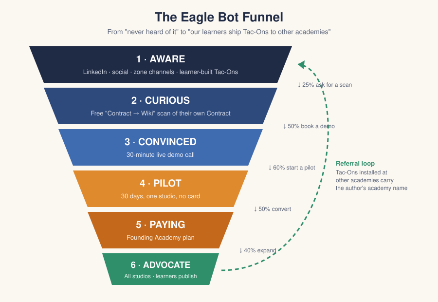

# Eagle Bot — Go-to-Market

*For the Eagle Bot team: the people who build it and the people who will sell it.*

Eagle Bot started as the operating system for one Acton academy. This folder is
the plan for selling it to others: who we sell to, how they find us, what we
charge, what it costs us, and what we do in the first 90 days.

## The funnel in one paragraph

Acton owners talk to each other constantly, and they trust what other owners
and learners show them more than anything we could say. So we don't start with
ads. We start by offering a free **Contract → Wiki scan**: an owner sends us
one studio's Contract, and within a day they get it back as a clean, searchable
wiki with every contradiction and gap flagged. That's the hook. Owners who like
it get a **live demo run by Eagle learners**, then a **30-day pilot in one
studio**, then a **Founding Academy plan**. Once they're paying, their learners
start publishing Tac-Ons to the market, and every Tac-On installed at another
academy tells that academy where it came from. That's how we grow without an
ad budget.

## What's in here

| File | What it answers |
| --- | --- |
| [01-audience.md](01-audience.md) | Who buys, who uses, who blocks, and where they spend time |
| [02-funnel.md](02-funnel.md) | Each stage: what happens, what we give them, what we measure |
| [03-pricing-and-costs.md](03-pricing-and-costs.md) | What it costs us to run, what we charge, the margin |
| [04-messaging.md](04-messaging.md) | Positioning, landing page copy, objections, email sequence |
| [05-launch-playbook.md](05-launch-playbook.md) | The first 90 days, week by week, and the numbers to watch |

## Illustrations

| File | Shows |
| --- | --- |
| [funnel.svg](illustrations/funnel.svg) | The six stages and the target conversion rate between each |
| [flywheel.svg](illustrations/flywheel.svg) | How learner-built Tac-Ons turn customers into leads |
| [pilot-journey.svg](illustrations/pilot-journey.svg) | The four "aha" moments in a 30-day pilot |
| [unit-economics.svg](illustrations/unit-economics.svg) | Monthly revenue vs. cost as academies join |

## Three things that make this different from selling normal school software

1. **Learners can run the sale.** Selling Eagle Bot to other academies is a
   real Quest with real stakes: real customers, real revenue, a real
   Exhibition. The demo is more convincing from a 13-year-old who uses it every
   day than from an adult. See [05-launch-playbook.md](05-launch-playbook.md#learner-sales-team).
2. **The product respects Acton's rules.** The AI never invents a rule, never
   rewrites learner wording, and never lets a Guide's memo override a vote.
   That line is the whole pitch to an owner who is nervous about AI.
3. **Costs are tiny and mostly fixed.** Two subscriptions plus pay-as-you-go
   Claude API. One paying academy covers the subscriptions. See
   [03-pricing-and-costs.md](03-pricing-and-costs.md).
